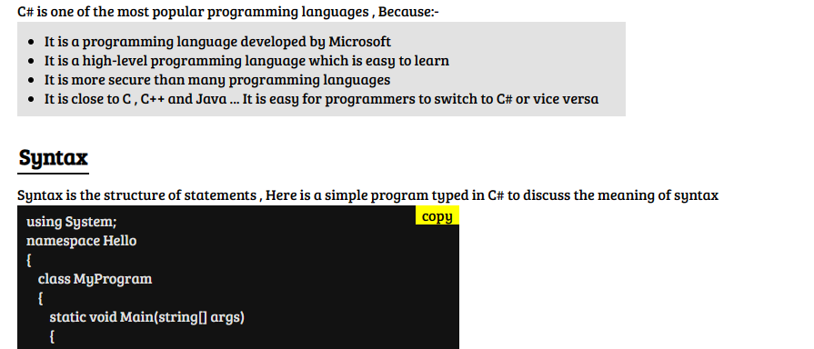

# technical-documentation

# Description

This project is part of the Javascript internship held by intern2grow .

---

## Details

The task is to add an icon on each code sample, so user can copy the code to clipboard by clicking on this icon.

---

# Click the image for live demo

## Technologies used

---

1. HTML5
2. Css3
3. Javascript (ES6+)

## Features

---

- [x] Responsive Design
- [x] Task Accomplished.

## Nice to know

It is awesome when you many wires being connected in this nice task including:

- manipulating the DOM (and dealing with NODES)using vanilla JS
- copying to the clipboard
- Async/await
- ForEach function.

*

Happy Coding 😍

fork the repository and start working on it.

best of luck.
